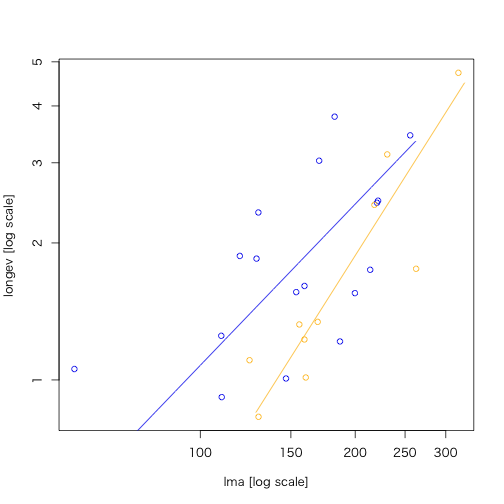

```{r knitsetup, echo = FALSE, results = 'hide', warning = FALSE, message = FALSE, cache = FALSE}
opts_knit$set(base.dir = './', fig.path = '', out.format = 'md')
opts_chunk$set(prompt = TRUE, comment = '', results = 'markup', fig.path = '../Figure/')
# See yihui.name/knitr/options for more Knitr options.
##### Put other setup R code here
# end setup chunk
```
# smatr: (Standardised) Major Axis Estimation and Testing Routines

[](http://cran.rstudio.com/web/packages/smatr/index.html)

* CRAN: http://cran.r-project.org/web/packages/smatr/index.html

```{r}
library(smatr)
library(dplyr)
```

バージョン: `r packageVersion("smatr")`

-----

```{r, echo = FALSE, results = "asis", eval = FALSE}
library(help = "smatr")$info[[2]] %>% data.frame() %>% kable(format = "markdown")
```

| 関数名 | 概略 |
|--------|------|
| `coef.sma` | Extract coefficients from a 'sma' or 'ma' fit |
| `elev.com` | Test for equal elevation among several lines fitted with (standardised) major axes of common slope. |
| `elev.test` | One-sample test of a (standardised) major axis elevation |
| `fitted.sma` | Returns fitted values |
| `leaflife` | Leaf longevity and leaf mass per area for plant species from different sites |
| `leafmeas` | Leaf mass per area and photosynthetic rate for plant species from different sites |
| `line.cis` | Slope and elevation of a (standardised) major axis, with confidence intervals |
| `makeLogMinor` | Generate spacing for minor tick marks on a plot with log-scaled axes |
| `meas.est` | Measurement error variance estimation from repeated measures |
| `multcompmatrix` | Multiple comparisons graphical matrix |
| `plot.sma` | Draw an X-Y plot |
| `plotutils` | Utility plotting functions |
| `print.sma` | Print an object of class 'sma'. |
| `residuals.sma` | Extract model residuals |
| `seqLog` | Sequence Generation |
| `shift.com` | Test for no mean shift along a common (standardised) major axis |
| `slope.com` | Common slope test amongst several allometric lines|
| `slope.test` | One-sample test of a (standardised) major axis slope |
| `sma` | (Standardized) major axis estimation and testing for one or several samples |
| `smatr-package` | (Standardised) Major Axis Estimation and Testing Routines |
| `summary.sma` | Print a summary |

## leaflife （データセット）

```{r}
data("leaflife")
str(leaflife)
# site... 種の形質データを調査した地点コード
# rain... 各siteの年降雨量の区分（high or low）
# solip... 各siteにおける土壌窒素濃度の水準（high or low）
# longev... 葉寿命（単位は年）
# lma... 葉の面積あたりの重量(m2/kg)
summary(leaflife)
```

## sma: 

II型回帰モデル。複数ある形式にも対応。

leaflife %>% filter(soilp == "low", rain == "low") %>% 

```{r}
leaflife %$% ma(longev ~ lma, log = 'xy', data = .) # MA
```

回帰が有意なものであるか（slope = 1）を検証

```{r}
leaflife %$% ma(longev ~ lma, log = 'xy', slope.test = 1, data = .) %T>% 
  summary(.) -> res
```

`r res$slopetest[[1]]$p` であるので１より有意（*P* < 0.05）に異なる傾き slopeであるという結果となった

残差プロットを描く

```{r smatr_ma, eval=FALSE}
plot(res, type = "residual")
```

> （なにも描画されない？？）

```{r}
# 土壌窒素濃度が低いサイトのデータを抽出
leaf.low.soilp <- filter(leaflife, soilp == "low")
# nrow(leaf.low.soilp) # 27
```

降水量の高いサイト、低いサイトそれぞれでSMAによる当てはめ、傾きの違いを比較

```{r smatr_sma, eval = FALSE}
leaf.low.soilp %>% sma(formula = "longev ~ lma * rain", 
                       log = "xy", data = .) %>% {
  print(.)
  plot(.)
}
```

年降雨量の多さ（high and low）が葉寿命に効いていないという帰無仮説H0に対して、*P* = 0.12395が得られた。帰無仮説を棄却することはできないということになる。

