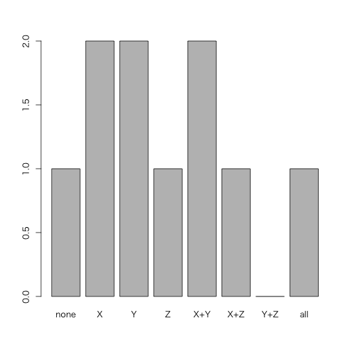
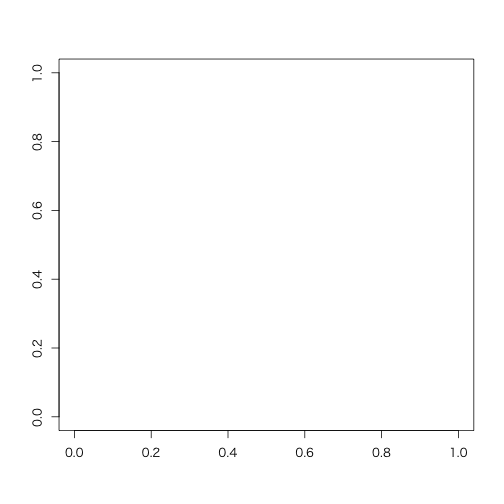

# rafalib: Convenience Functions for Routine Data Exploration

データ探索の作業を簡単にするパッケージ

[](http://cran.rstudio.com/web/packages/rafalib/index.html)

* CRAN: http://cran.r-project.org/web/packages/rafalib/index.html
* GitHub: https://github.com/ririzarr/rafalib


```r
> library(rafalib)
```

バージョン: 1.0.0

-----


| 関数名 | 概略 |
|--------|------|
| `as.fumeric` | converts to factor and then numeric |
| `bartab` | bartab |
| `imagemat` | image of a matrix |
| `imagesort` | image with sorted rows |
| `install_bioc` | Install or update Bioconductor and CRAN packages |
| `largeobj` | What are the largest objects in memory? |
| `maplot` | Bland Altman plot aka MA plot |
| `mypar` | mypar |
| `myplclust` | plclust in colour |
| `nullplot` | nullplot |
| `peek` | peek at the top of a text file |
| `popsd` | population standard deviation |
| `popvar` | population variance |
| `sboxplot` | smart boxplot |
| `shist` | smooth histogram |
| `splitit` | split it |
| `splot` | smart plot |

-----

## as.fumeric


```r
> group <- c("a","a","b","b")
> as.fumeric(group) %>% {
+   print(.)
+   class(.)
+ }
```

```
[1] 1 1 2 2
```

```
[1] "numeric"
```

## bartab


```r
> set.seed(1)
> (x <- sample(c(FALSE,TRUE), 10, replace=TRUE))
> y <- sample(c(FALSE,TRUE), 10, replace=TRUE)
> z <- sample(c(FALSE,TRUE), 10, replace=TRUE)
> bartab(x, y, z, c("X","Y","Z"))
```



## largeobj

もっともメモリーを消費しているオブジェクトとそのサイズを返す


```r
> x <- rnorm(10^5)
> y <- rnorm(10^6)
> z <- rnorm(2 * 10^6)
> w <- rnorm(3 * 10^6)
> largeobj(n = 3, units = "Mb")
```

```
bird.families             p          dune 
       "0 Mb"        "0 Mb"        "0 Mb" 
```

## nullplot

枠と軸だけのプロットを描画


```r
> nullplot()
```



